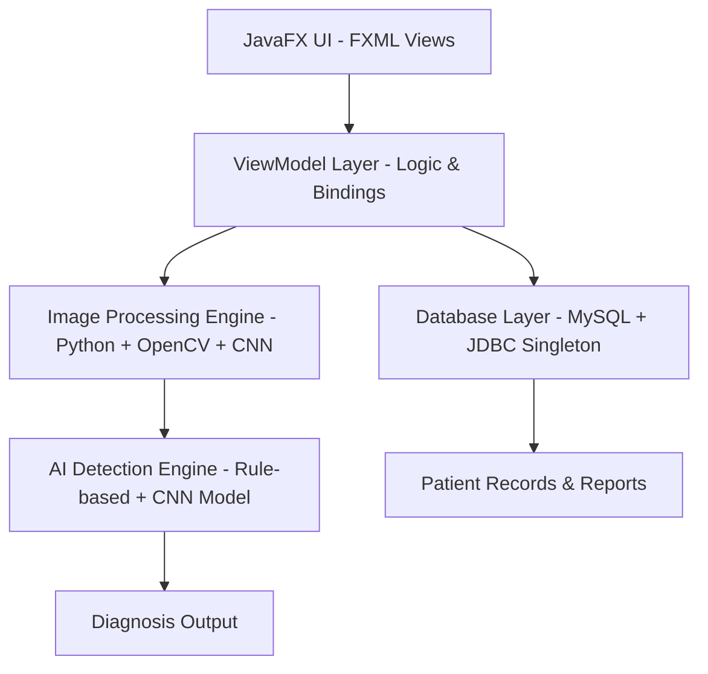

# 🧠 dAIbetes
### AI-Powered Retinal Diagnostic Support System for Early Detection of Diabetic Retinopathy & Glaucoma

<p align="center">
  
</p>

<p align="center">
  
  
  
  
  
</p>

---

## 🚀 Overview

**dAIbetes** is an intelligent medical decision-support system designed to assist healthcare professionals in the early detection of diabetic retinopathy and glaucoma using AI-powered retinal image analysis.

It combines:
- 🧬 Digital Image Processing (DIP)
- 🤖 Machine Learning (CNN + Rule-based AI)
- 🧑‍⚕️ Human-in-the-loop validation system

to ensure accuracy, safety, and clinical reliability.

---

## 🎯 Mission

> “Early detection saves vision.”

dAIbetes aims to reduce preventable blindness by enabling fast, AI-assisted retinal screening while keeping final diagnostic control in human doctors’ hands.

---

## 🧩 System Architecture



---

## 🧠 Core Features

### 🩺 Doctor Module
- AI-powered retinal image enhancement (CLAHE, Gaussian Blur)
- CNN + rule-based abnormality detection
- Visual overlays for medical interpretation
- Human validation before diagnosis release

### 👤 Patient Module
- Secure diagnostic history portal
- Long-term eye health tracking
- Simplified AI-generated explanations

---

## 🏗️ Tech Stack

| Layer | Technology |
|------|------------|
| Frontend | JavaFX (FXML + MVVM) |
| Backend | Java 17+ |
| AI / Processing | Python (OpenCV, TensorFlow) |
| Database | MySQL 8+ |
| Build Tool | Maven |

---

## 🧠 Architecture Principles

### Object-Oriented Design
- Encapsulation → Medical data protection
- Inheritance → User → Doctor / Patient
- Polymorphism → Role-based system behavior

### Design Patterns
- Singleton → Database connection manager
- Decorator → Image processing filters
- Strategy → AI model switching
- MVVM → UI separation

---

## 📁 Project Structure

```
src/main/java/org/daibetes/
├── controller/
├── model/
├── viewmodel/
├── util/
└── Main.java
```

---

## ⚙️ Getting Started

### Requirements
- Java 17+
- Maven
- MySQL 8+
- Python 3.9+ (OpenCV, TensorFlow)

### Installation

```bash
git clone https://github.com/dalrho/dAIbetes.git

# Import database schema
resources/db_schema.sql

# Run the application
mvn clean javafx:run
```

---

## 📊 System Goals

- 🧠 Early detection of retinal diseases  
- 🤖 AI-assisted medical decision support  
- 🔐 Secure patient data handling  
- 📈 Scalable and maintainable architecture  

---

## 🌟 Why dAIbetes?

- Reduces diagnostic delays  
- Assists overloaded medical professionals  
- Enhances accuracy with AI + human validation  
- Built for real-world clinical use  

---

## 👥 Development Team

- Angela Jahziel Encabo — Lead Developer  
- Harold Shichiya I. Amistad — Backend Developer  
- Gerald Ares — Frontend Developer  
- Ycia Debby Magnanao — Backend & Database  
- Jhen Aloyon — Backend & Database  

---

## 📌 Summary

**dAIbetes** is a medical AI decision-support system that combines image processing, machine learning, and software engineering principles to assist doctors in faster and more accurate retinal diagnosis—while ensuring human oversight remains central.
```
